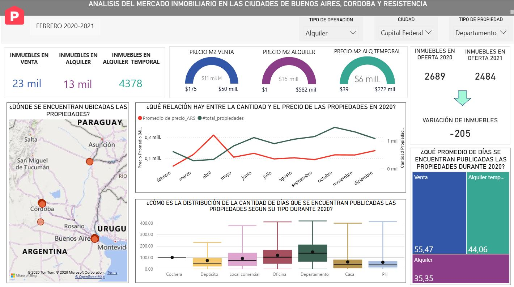
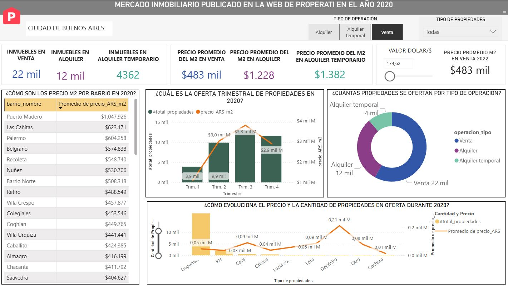
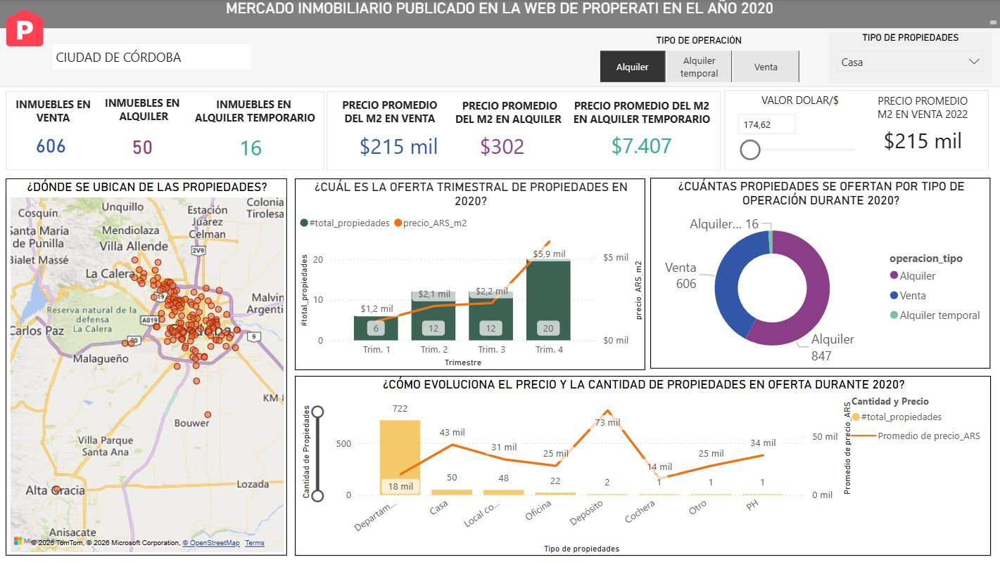
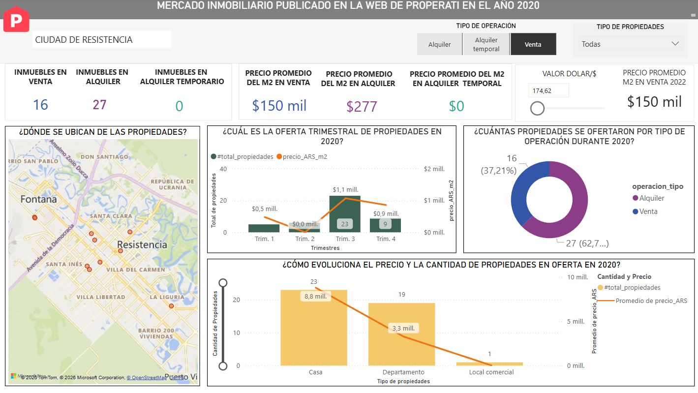
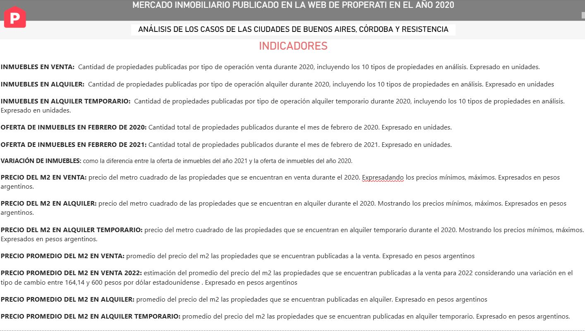

# Análisis del mercado inmobiliario – Properati 2020-2021

## Mercado inmobiliario en tres ciudades argentinas

Este proyecto analiza publicaciones inmobiliarias del portal Properati para entender el comportamiento de la oferta en **Capital Federal, Córdoba y Resistencia** entre 2020 y 2021.

El análisis busca comparar tipos de operación, tipos de propiedad, tiempo en mercado y precio por m², con foco en detectar patrones, diferencias territoriales y oportunidades de lectura estratégica.

---

## Objetivo del análisis

- Analizar cuánto tiempo permanecen publicadas las propiedades según ciudad, tipo de propiedad y operación  
- Comparar el precio promedio por m² entre venta, alquiler y alquiler temporario  
- Explorar la distribución de la oferta inmobiliaria en distintas ciudades  
- Identificar barrios más costosos y menos costosos en CABA  
- Analizar la evolución de la oferta durante 2020 y comienzos de 2021  

---

## ¿Qué buscamos responder?

El tablero fue diseñado para responder preguntas como:

- ¿Qué tipo de propiedades permanecen más tiempo en el mercado?  
- ¿Cómo se comporta la oferta inmobiliaria en distintas ciudades?  
- ¿Qué diferencias existen entre venta, alquiler y alquiler temporario?  
- ¿Qué barrios concentran los valores más altos y más bajos en CABA?  
- ¿Cómo evolucionó la cantidad de publicaciones entre febrero de 2020 y febrero de 2021?  

---

## Métricas clave

- Total de inmuebles publicados  
- Precio promedio por m²  
- Tiempo promedio de publicación  
- Cantidad de publicaciones por tipo de operación  
- Variación de publicaciones entre febrero 2020 y febrero 2021  

---

## Tecnologías utilizadas

- Power BI  
- Power Query  
- Excel  
- Lucidchart / DER  
- PowerPoint  

---

## Modelado de datos

El proyecto se construyó a partir de publicaciones del portal Properati, recortando el análisis a tres ciudades:

- Capital Federal  
- Córdoba  
- Resistencia  

Se trabajó sobre un modelo relacional con dimensiones como:

- Ciudad  
- Barrio  
- Tipo de propiedad  
- Tipo de operación  
- Calendario  

El dataset requirió limpieza, estandarización y normalización previa para poder construir un modelo consistente y analizable.

---

## Transformaciones y preparación de datos

Entre las principales tareas realizadas se encuentran:

- selección de las ciudades relevantes para el análisis  
- eliminación de columnas irrelevantes  
- renombrado de columnas al castellano  
- corrección de errores en ciudad, barrio y provincia  
- normalización de codificaciones y caracteres  
- generación de IDs para dimensiones  
- ajuste de formatos de fecha, latitud y longitud  
- cálculo de tiempo en días y meses de publicación  
- construcción de precio por m²  
- conversión de precios a ARS para unificar el análisis  

---

## Vista previa

### 🟦 Portada

### 📊 General

### 🏙️ CABA

### 🏢 Córdoba

### 🌿 Resistencia

### 📘 Diccionario de indicadores

---

## Documentación

Este proyecto cuenta con documentación detallada sobre el análisis, el modelado de datos y las decisiones de diseño.

👉 [Acceder a la documentación completa](https://docs.google.com/document/d/1cUSodSYZc4m5_mMRtyyIuUD3tQM2ZLEm9Hw1d4LtJNs/edit?usp=sharing)

---

## ⚠️ Consideraciones

Durante el análisis se detectaron inconsistencias en la carga de datos, como errores en ciudad, barrio y provincia.

Esto no solo afecta el análisis, sino que también evidencia oportunidades de mejora en la experiencia de carga del producto.

---

## 🚀 Líneas futuras

Este proyecto podría ampliarse para:

- incorporar más ciudades de Argentina  
- comparar resultados con otros países de la región  
- profundizar en la duración promedio de publicaciones por barrio  
- analizar la experiencia de carga de datos desde una perspectiva UX/UI  
- cruzar información con variables económicas o de emprendimiento local  

---

## 👤 Autoras

Sole Iójimo y Sofía Ruderman 
